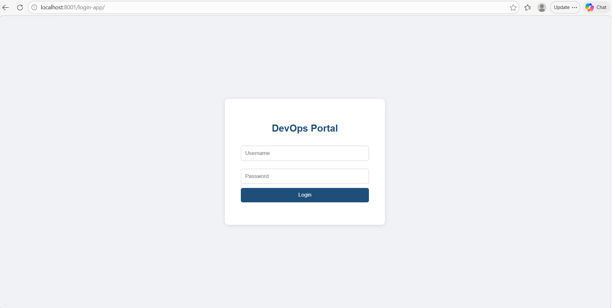
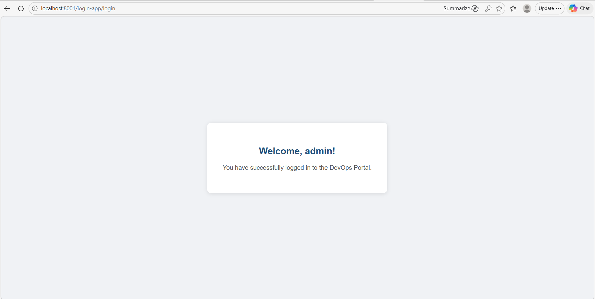
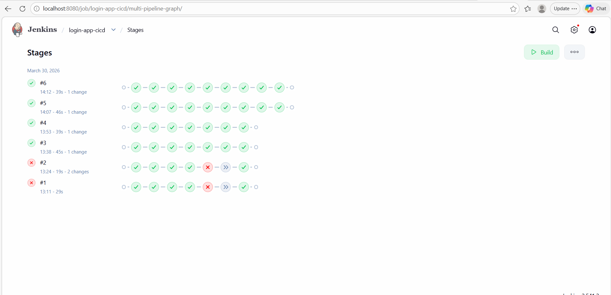
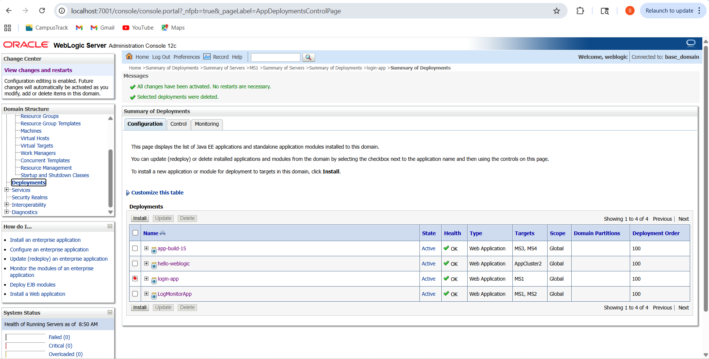

# 🔐 Login App — CI/CD Pipeline with Jenkins & WebLogic

A Java web application automatically built and deployed to Oracle WebLogic using a Jenkins declarative pipeline.

---

## 🚀 What This Project Does

Every time code is pushed to GitHub, Jenkins automatically:

- Pulls the latest code  
- Compiles it using Maven  
- Runs tests  
- Packages it into a WAR file  
- Deploys it to WebLogic Server (MS1)  
- Verifies the app is live  

---

## 🛠️ Tools Used

- Jenkins — Pipeline automation  
- Git & GitHub — Source code management  
- Apache Maven — Build and packaging  
- Oracle WebLogic 12c — Application server  
- Java 8 — Runtime  
- Linux (WSL) — Environment  

---

## 🔄 Pipeline Flow
GitHub Push → Jenkins → Maven Build → WAR File → WebLogic MS1 → Live App

---

## 📸 Screenshots

### 🔹 Login Page

### 🔹 Welcome Page

### 🔹 Jenkins Pipeline

### 🔹 WebLogic Console

---

## ▶️ How to Run

1. Start WebLogic Admin Server and Managed Servers  
2. Start Jenkins  
3. Trigger the pipeline — click **Build Now** in Jenkins  
4. Open the app:  
   `http://localhost:8001/login-app/`

### 🔑 Login Credentials
- Username: `admin`  
- Password: `admin123`  

---

## 🧩 Problems I Solved

- **Java version mismatch**  
  System had Java 17 but WebLogic 12c requires Java 8  
  ✔ Fixed by setting `JAVA_HOME` to Java 8 in Jenkinsfile  

- **WebLogic connection error**  
  Deployer requires `t3://` protocol instead of `http://`  
  ✔ Updated admin URL  

- **Servlet not found (404)**  
  WebLogic 12c uses `javax.servlet`, not `jakarta.servlet`  
  ✔ Updated dependency in `pom.xml`  

---

## 👨‍💻 Author

**Shanmukha R D**  
DevOps & Infrastructure Engineer
